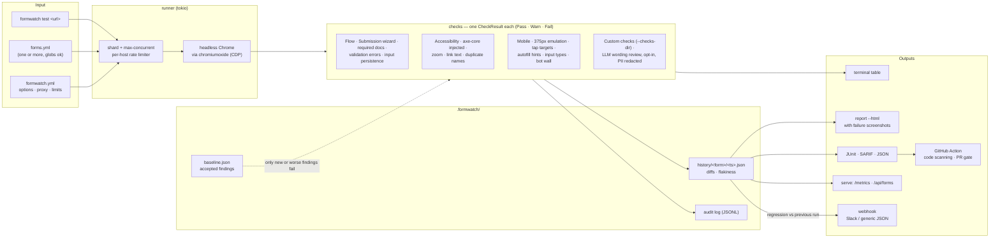
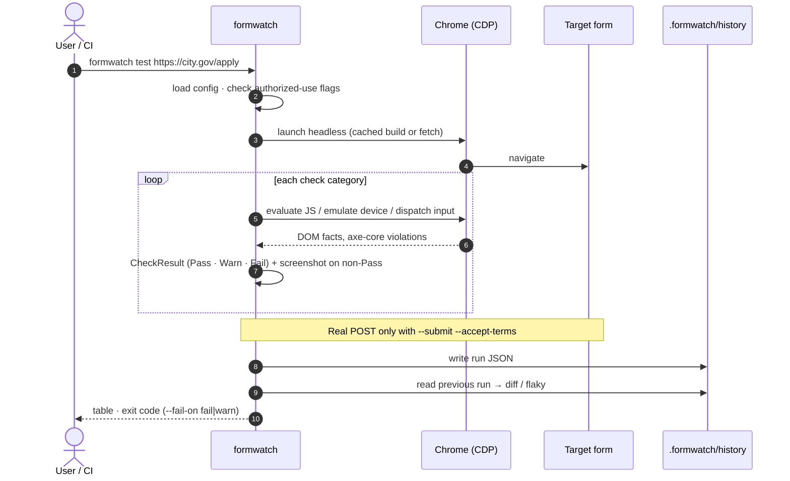

# formwatch diagrams

Rendered copies live in [`docs/images/`](images/). Background for these
diagrams: [ADR-0001](adr/0001-formwatch-architecture.md) (architecture) and
[ADR-0002](adr/0002-enterprise-hardening.md) (authorized-use hardening).

## Check pipeline

From a form registry to the places results end up.

## One `formwatch test` run

